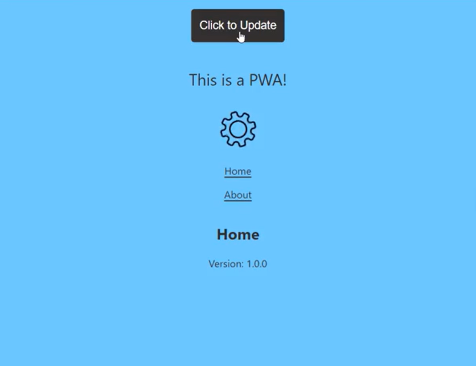

# Controlled Updates with PWAs and Service workers

This is a working prototype with minimal code and functionality designed to demonstrate how to manage updates using service workers in Progressive Web Applications.

This prototype allows users to continue using the old version of the application. When a new version becomes available, they will see an update button. They have the choice to either accept the new version or continue using the old one for as long as they prefer.

Additionally, we have the capability to enforce major updates and display notifications for minor or patch updates (Allowing the user to pull the updates conveniently). While this code doesn't specifically demonstrate how to force updates, once you comprehend and implement the code, you'll be able to achieve that effortlessly with a few adjustments.

## Tech Stack

React, typescript, Node >= 18.15.0

## Screenshots



## Installation

Got to the root of the codebase

```bash
  npm install
  cd controlled-updates-pwa
  cp .env.example .env
```

## Run Locally

Clone the project

```bash
  git clone https://github.com/karansamra/controlled-updates-pwa.git
```

Go to the project directory

```bash
  cd controlled-updates-pwa
```

Install dependencies

```bash
  npm install
```

Start the server

```bash
  npm run start
```

## Environment Variables

To run this project, you will need to add the following environment variables to your .env file

REACT_APP_REGISTER_SW="true"
REACT_APP_VERSION_ID="1.0.0"

## Documentation

### Introduction

This document outlines our approach to optimizing Progressive Web Applications (PWAs) using service workers. Service workers, pivotal in PWAs, handle background processes through separate scripts, expertly managing cache for smoother user experiences.

Central to this approach is the intricate management of cache, which is critical for system performance and user interactions. Service workers take on a multifaceted role, meticulously managing and clearing caches as needed. Our strategy leverages service workers to promptly notify users of new versions.

These workers actively monitor new builds, comparing them with the current browser build. In this prototype, we have used navigation events to notify users to pull updates effortlessly. This document provides insights into our implementation strategy, highlighting the vital role of service workers in streamlining cache management and updates in our PWA ecosystem.

### The Significance of Controlled Updates in the Age of Progressive Web Apps (PWAs)

In the ever-evolving landscape of Progressive Web Apps (PWAs), the ability to manage updates effectively stands as a pivotal element for both users and developers. The capability to notify users about new versions, differentiate between optional and critical updates, and execute controlled deployment mechanisms represents a cornerstone in ensuring a seamless user experience.

The implementation of controlled updates introduces a nuanced approach to update management. Users are empowered to defer optional updates, granting them the autonomy to decide when to adopt new features or modifications. Simultaneously, critical updates are enforced, guaranteeing that users promptly receive essential enhancements or security patches for an uninterrupted experience.

One of the instrumental methods for facilitating this control lies in the utilization of toast notifications integrated with interactive elements such as buttons. Overlays can be used to block the entire app until the user accepts the critical update. Unobtrusive yet impactful notifications serve as an efficient means to communicate update availability and provide users with the necessary options to manage the update process according to their preferences.

This prototype showcases the initial stages of incorporating controlled updates, manifesting through the display of an update button. However, it represents only a fraction of the comprehensive functionalities that can be achieved through controlled update mechanisms.

### Technologies Used

To implement this prototype, we have used #Typescript, #CSS, #HTML, and #React.

To install React, we have used this command

> npx create-react-app controlled-updates-pwa --template cra-template-pwa-typescript
> https://create-react-app.dev/docs/making-a-progressive-web-app/

### Prototype Implementation

Initiating from the environment file, we should streamline the service worker registration process using a specific flag. Enabling this flag triggers the registration of the service worker in your browser, allowing its display within the application tab of the debugger tool.

It's crucial to note that the service worker registration is dependent on this flag being turned on. Only upon activation will the service worker be successfully registered and visible in the application tab of the debugger tool.

#### Setting flag in ENV file

REACT_APP_REGISTER_SW = true;

#### Checking for an update

Normally, the service worker's browser life-cycle will handle update checks for us by listening to the event when a user navigates to a new page that is in the service worker’s scope (or when register() is called again with a different URL). Unfortunately for SPA web apps, page navigations are a rare event; users will stay on the same page with navigation handled in the app functionality. This means that the example SPA application needs to manually trigger the browser to update the service worker.

This can be done by adding some extra events to the application so that a service worker update check is performed on every navigation transition. Using React Router, the useLocation() method can be used to hook into route transitions and perform an action that manually instructs the browser to check for a new service worker:

```
 const location = useLocation();
 React.useEffect(() => {
   if ('serviceWorker' in navigator) {
     navigator.serviceWorker.ready.then((registration) => {
       registration.update();
     });
   }
 }, [location]);
```

Checking the app in the browser after deploying an update, we can see that after a route transition takes place, the browser has fetched the new service worker. The new worker can be seen by opening up browser dev tools and navigating to Application > Service Workers (chrome). This view shows the current service worker that is running with the updated worker in a “waiting to activate” state.

This means that the browser is now checking and fetching new service worker versions, all without needing to refresh the current tab manually. This is great but it will be useful to have a method to inform user’s that a new version is pending with a call to action to update.

#### Gracefully updating the application

Now the application has a new service worker waiting to be activated, it will be great to have an alert or notification presented to the user that allows them to update. To implement this, the main App component mounting can be wrapped with the extra functionality to plug into service worker actions. Updating the src/index.tsx file by adding a higher order component (wrapper) will allow the application to talk to the service worker registration, adding the functionality:
New state to show when an update is available to the app.
An action to perform the update and refresh the app.
To help with showing new service worker updates, the Create React App template code has already given us a service worker register() method in the index.tsx file which can be extended to include a callback for update events. This allows for a component state update to be updated on service worker changes:

```
const withSwRegistration = (WrappedComp: FC<WrappedCompProps>, ) => {
 return () => {

   // State for flagging if an app update is available
   const [appUpdatePending, setAppUpdatePending] = useState(false);

   // Updates the state when a new update is pending.
   const onSWUpdate = () => {
     setAppUpdatePending(true);
   }

   // Registers the service worker based on config setting,
   // updated to include a onUpdate callback.
   if (window.REACT_APP_REGISTER_SW === true) {
     serviceWorkerRegistration.register({ onUpdate: onSWUpdate });
   } else {
     serviceWorkerRegistration.unregister();
   }

   // Returns the wrapped function, in this case it will be <App />
   return (
     <WrappedComp appUpdatePending={appUpdatePending} />
   )
 }
};
```

Using this functionality and passing down the ‘appUpdatePending’ status into the App component, the application can use it to show a notification to the user that an update is ready. In the example app, an update button is shown in the header:

Using this functionality and passing down the ‘appUpdatePending’ status into the App component, the application can use it to show a notification to the user that an update is ready. In the example app, an update button is shown in the header:

```
const withSwRegistration = (WrappedComp: FC<WrappedCompProps>, ) => {
 return () => {

   ...

   // action for updating the service worker.
   const updateAction = () => {
     if ('serviceWorker' in navigator) {
       navigator.serviceWorker.ready.then((registration) => {
         if (registration.waiting) {

           // send the skip message to kick off the service worker install.
           registration.waiting.postMessage({type: 'SKIP_WAITING'});

           // add an listener to reload page when the new service worker is ready.
           registration.waiting.addEventListener('statechange', (event: Event) => {
             const { state = '' } =  event.target as unknown as {state: string} || {};
             if (state === 'activated') {
               window.location.reload();
             }
           });
         }
       });
     }
   };

   ...

   return (
     <WrappedComp updateAction={updateAction} appUpdatePending={appUpdatePending} />
   )
 }
};
```

With the above action being passed down into the click event for the update notification, the app now updates the service worker, then reloads the page to show the latest version of the application.

Although this example uses a wrapper component, the same actions can be implemented using global state management (Redux, for example).

## Authors

- [@karansamra](https://www.github.com/karansamra)
